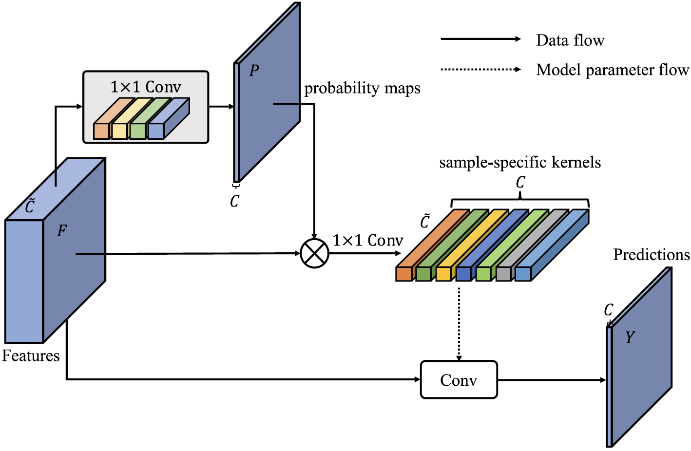

# [CondNet: Conditional Classifier for Scene Segmentation](https://arxiv.org/pdf/2109.10322.pdf)

[](https://paperswithcode.com/sota/semantic-segmentation-on-pascal-context?p=condnet-conditional-classifier-for-scene)
[](https://paperswithcode.com/sota/semantic-segmentation-on-ade20k?p=condnet-conditional-classifier-for-scene)

## Introduction

The fully convolutional network (FCN) has achieved
tremendous success in dense visual recognition tasks, such as
scene segmentation. The last layer of FCN is typically a global
classifier (1×1 convolution) to recognize each pixel to a semantic
label. We empirically show that this global classifier, ignoring the
intra-class distinction, may lead to sub-optimal results.

In this work, we present a conditional classifier to replace the
traditional global classifier, where the kernels of the classifier
are generated dynamically conditioned on the input. The main
advantages of the new classifier consist of: (i) it attends on
the intra-class distinction, leading to stronger dense recognition
capability; (ii) the conditional classifier is simple and flexible
to be integrated into almost arbitrary FCN architectures to improve the prediction. 
Extensive experiments demonstrate that the
proposed classifier performs favourably against the traditional
classifier on the FCN architecture. The framework equipped with
the conditional classifier (called CondNet) achieves new state-of-the-art performances on two datasets.

<div align="center">
  
</div>
<br />

## Major Features
- Simple and Flexible
- Incorporated with almost arbitrary FCN architectures
- Attending on the sample-specific distinction of each category


## Results and Models
### ADE20K

| Method  | Backbone | Crop Size | Lr schd |  mIoU | mIoU(ms+flip) | config                                                           | download  |
| ------- | -------- | --------- | ------: | ----: | ------------: | ---------------------------------------------------------------- | --------- |
| CondNet | R-50-D8  | 512x512   |  160000 | 43.68 |         44.30 | [config](configs/condnet/condnet_r50-d8_512x512_160k_ade20k.py)  | [model]() |
| CondNet | R-101-D8 | 512x512   |  160000 | 45.64 |         47.12 | [config](configs/condnet/condnet_r101-d8_512x512_160k_ade20k.py) | [model]() |

#### Pascal Context 59

| Method  | Backbone | Crop Size | Lr schd |  mIoU | mIoU(ms+flip) | config                                                                                      | download  |
| ------- | -------- | --------- | ------: | ----: | ------------: | ------------------------------------------------------------------------------------------- | --------- |
| CondNet | R-101-D8 | 480x480   |   80000 | 54.29 |         55.74 | [config](configs/condnet/condnet_r101-d8_headlrx10_lr1e-3_480x480_80k_pascal_context_59.py) | [model]() |

## Environments
The code is developed using python 3.7 on Ubuntu 16.04. NVIDIA GPUs are needed. The code is developed and tested using 8 NVIDIA V100 GPU cards. Other platforms or GPU cards are not fully tested.

## Quick Start

### Prerequisites

- Linux or macOS (Windows is in experimental support)
- Python 3.6+
- PyTorch 1.3+
- CUDA 9.2+ (If you build PyTorch from source, CUDA 9.0 is also compatible)
- GCC 5+
- [MMCV](https://mmcv.readthedocs.io/en/latest/#installation)
- [MMSegmentation](https://github.com/open-mmlab/mmsegmentation/blob/master/docs/get_started.md#installation)

Please refer to the [guide](https://github.com/open-mmlab/mmsegmentation/blob/master/docs/get_started.md#installation) for the information about he compatible MMSegmentation and MMCV versions. Please install the correct version of MMCV to avoid installation issues.

Note: You need to run `pip uninstall mmcv` first if you have mmcv installed.
If mmcv and mmcv-full are both installed, there will be `ModuleNotFoundError`.

### Installation

a. Create a conda virtual environment and activate it.

```shell
conda create -n open-mmlab python=3.7 -y
conda activate open-mmlab
```

b. Install PyTorch and torchvision following the [official instructions](https://pytorch.org/).
Here we use PyTorch 1.6.0 and CUDA 10.1.
You may also switch to other version by specifying the version number.

```shell
conda install pytorch=1.6.0 torchvision cudatoolkit=10.1 -c pytorch
```

c. Install [MMCV](https://mmcv.readthedocs.io/en/latest/) following the [official instructions](https://mmcv.readthedocs.io/en/latest/#installation).
Either `mmcv` or `mmcv-full` is compatible with MMSegmentation, but for methods like CCNet and PSANet, CUDA ops in `mmcv-full` is required.

The pre-build mmcv-full (with PyTorch 1.6 and CUDA 10.1) can be installed by running: (other available versions could be found [here](https://mmcv.readthedocs.io/en/latest/#install-with-pip))

```shell
pip install mmcv-full -f https://download.openmmlab.com/mmcv/dist/cu101/torch1.6.0/index.html
```

Or you should download the cl compiler from web and then set up the path.

Then, clone mmcv from github and install mmcv via pip:

```shell
git clone https://github.com/open-mmlab/mmcv.git
cd mmcv
pip install -e .
```

Or simply:

```shell
pip install mmcv
```

d. Install build requirements
```shell
pip install -r requirements.txt
```

## Prepare datasets
It is recommended to symlink the dataset root to `$CONDNET/data`.
If your folder structure is different, you may need to change the corresponding paths in config files.

```none
condnet
├── models
├── tools
├── configs
├── data
│   ├── VOCdevkit
│   │   ├── VOC2012
│   │   │   ├── JPEGImages
│   │   │   ├── SegmentationClass
│   │   │   ├── ImageSets
│   │   │   │   ├── Segmentation
│   │   ├── VOC2010
│   │   │   ├── JPEGImages
│   │   │   ├── SegmentationClassContext
│   │   │   ├── ImageSets
│   │   │   │   ├── SegmentationContext
│   │   │   │   │   ├── train.txt
│   │   │   │   │   ├── val.txt
│   │   │   ├── trainval_merged.json
│   │   ├── VOCaug
│   │   │   ├── dataset
│   │   │   │   ├── cls
│   ├── ade
│   │   ├── ADEChallengeData2016
│   │   │   ├── annotations
│   │   │   │   ├── training
│   │   │   │   ├── validation
│   │   │   ├── images
│   │   │   │   ├── training
│   │   │   │   ├── validation
```

### ADE20K

The training and validation set of ADE20K could be download from this [link](http://data.csail.mit.edu/places/ADEchallenge/ADEChallengeData2016.zip).
We may also download test set from [here](http://data.csail.mit.edu/places/ADEchallenge/release_test.zip).

### Pascal Context

The training and validation set of Pascal Context could be download from [here](http://host.robots.ox.ac.uk/pascal/VOC/voc2010/VOCtrainval_03-May-2010.tar). You may also download test set from [here](http://host.robots.ox.ac.uk:8080/eval/downloads/VOC2010test.tar) after registration.

To split the training and validation set from original dataset, you may download trainval_merged.json from [here](https://codalabuser.blob.core.windows.net/public/trainval_merged.json).

If you would like to use Pascal Context dataset, please install [Detail](https://github.com/zhanghang1989/detail-api) and then run the following command to convert annotations into proper format.

```shell
python tools/convert_datasets/pascal_context.py data/VOCdevkit data/VOCdevkit/VOC2010/trainval_merged.json
```

More datasets please refer to MMSegmentation.

## Training and Testing

All outputs (log files and checkpoints) will be saved to the working directory,
which is specified by `work_dir` in the config file.

By default we evaluate the model on the validation set after some iterations, you can change the evaluation interval by adding the interval argument in the training config.

```python
evaluation = dict(interval=4000)  # This evaluate the model per 4000 iterations.
```

**\*Important\***: The default learning rate in config files is for 4 GPUs and 2 img/gpu (batch size = 4x2 = 8).
Equivalently, you may also use 8 GPUs and 1 imgs/gpu since all models using cross-GPU SyncBN.

To trade speed with GPU memory, you may pass in `--options model.backbone.with_cp=True` to enable checkpoint in backbone.

### Training 
 
**Train with a single GPU**

```shell
python tools/train.py ${CONFIG_FILE} [optional arguments]
```

If you want to specify the working directory in the command, you can add an argument `--work-dir ${YOUR_WORK_DIR}`.

**Train with multiple GPUs**

```shell
./tools/dist_train.sh ${CONFIG_FILE} ${GPU_NUM} [optional arguments]
```

Optional arguments are:

- `--no-validate` (**not suggested**): By default, the codebase will perform evaluation at every k iterations during the training. To disable this behavior, use `--no-validate`.
- `--work-dir ${WORK_DIR}`: Override the working directory specified in the config file.
- `--resume-from ${CHECKPOINT_FILE}`: Resume from a previous checkpoint file (to continue the training process).
- `--load-from ${CHECKPOINT_FILE}`: Load weights from a checkpoint file (to start finetuning for another task).

Difference between `resume-from` and `load-from`:

- `resume-from` loads both the model weights and optimizer state including the iteration number.
- `load-from` loads only the model weights, starts the training from iteration 0.

**Launch multiple jobs on a single machine**

If you launch multiple jobs on a single machine, e.g., 2 jobs of 4-GPU training on a machine with 8 GPUs,
you need to specify different ports (29500 by default) for each job to avoid communication conflict. Otherwise, there will be error message saying `RuntimeError: Address already in use`.

If you use `dist_train.sh` to launch training jobs, you can set the port in commands with environment variable `PORT`.

```shell
CUDA_VISIBLE_DEVICES=0,1,2,3 PORT=29500 ./tools/dist_train.sh ${CONFIG_FILE} 4
CUDA_VISIBLE_DEVICES=4,5,6,7 PORT=29501 ./tools/dist_train.sh ${CONFIG_FILE} 4
```

If you use `slurm_train.sh` to launch training jobs, you can set the port in commands with environment variable `MASTER_PORT`.

```shell
MASTER_PORT=29500 ./tools/slurm_train.sh ${PARTITION} ${JOB_NAME} ${CONFIG_FILE}
MASTER_PORT=29501 ./tools/slurm_train.sh ${PARTITION} ${JOB_NAME} ${CONFIG_FILE}
```

### Testing

- single GPU
- single node multiple GPU

You can use the following commands to test a dataset.

```shell
# single-gpu testing
python tools/test.py ${CONFIG_FILE} ${CHECKPOINT_FILE} [--out ${RESULT_FILE}] [--eval ${EVAL_METRICS}] [--show]

# multi-gpu testing
./tools/dist_test.sh ${CONFIG_FILE} ${CHECKPOINT_FILE} ${GPU_NUM} [--out ${RESULT_FILE}] [--eval ${EVAL_METRICS}]
```

Optional arguments:

- `RESULT_FILE`: Filename of the output results in pickle format. If not specified, the results will not be saved to a file. (After mmseg v0.17, the output results become pre-evaluation results or format result paths)
- `EVAL_METRICS`: Items to be evaluated on the results. Allowed values depend on the dataset, e.g., `mIoU` is available for all dataset. Cityscapes could be evaluated by `cityscapes` as well as standard `mIoU` metrics.
- `--show`: If specified, segmentation results will be plotted on the images and shown in a new window. It is only applicable to single GPU testing and used for debugging and visualization. Please make sure that GUI is available in your environment, otherwise you may encounter the error like `cannot connect to X server`.
- `--show-dir`: If specified, segmentation results will be plotted on the images and saved to the specified directory. It is only applicable to single GPU testing and used for debugging and visualization. You do NOT need a GUI available in your environment for using this option.
- `--eval-options`: Optional parameters for `dataset.format_results` and `dataset.evaluate` during evaluation. When `efficient_test=True`, it will save intermediate results to local files to save CPU memory. Make sure that you have enough local storage space (more than 20GB). (`efficient_test` argument does not have effect after mmseg v0.17, we use a progressive mode to evaluation and format results which can largely save memory cost and evaluation time.)

Examples:

Assume that you have already downloaded the checkpoints to the directory `checkpoints/`.

Test CondNet with 4 GPUs, and evaluate the standard mIoU metric.

    ```shell
    ./tools/dist_test.sh configs/condnet/condnet_r101-d8_512x512_160k_ade20k.py \
        checkpoints/condnet_r101-d8_512x512_160k_ade20k.pth \
        4 --out results.pkl --eval mIoU
    ```

## Citation

If you find this project useful in your research, please consider cite:

```latex
@ARTICLE{Yucondnet21,
  author={Yu, Changqian and Shao, Yuanjie and Gao, Changxin and Sang, Nong},
  journal={IEEE Signal Processing Letters}, 
  title={CondNet: Conditional Classifier for Scene Segmentation}, 
  year={2021},
  volume={28},
  number={},
  pages={758-762},
  doi={10.1109/LSP.2021.3070472}}
```


## Acknowledgement
Thanks to:
- [MMSegmentation](https://github.com/open-mmlab/mmsegmentation)
- [AdelaiDet](https://github.com/aim-uofa/AdelaiDet)
